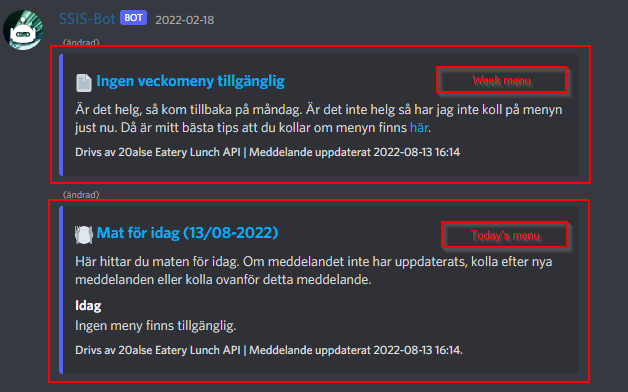
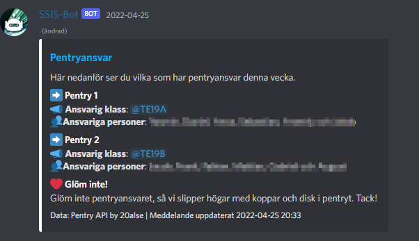
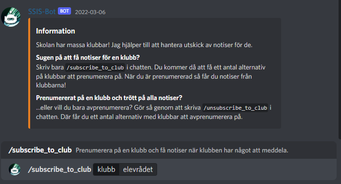

# SSIS-related Discord Bot

(SSIS=Stockholm Science & Innovation School)

This Discord bot is has various capabilities related to the school Stockholm Science & Innovation School.

> **Warning**
> 
> On 2023-03-10, the basic file structure of the bot was changed.
> Please see [this document](MIGRATE_MARCH_2023.md) for more information.

> **Note**
>
> [Dockerfiles](Dockerfile) for the bot are still beta. They may or may not work properly.
 
### Feature breakdown

#### Lunch menu information

* The bot can retrieve lunch menu information and edit a message it has created with a lunch menu message on a given time each day. 

* The bot can send PM's with the lunch menu to users who has subscribed to it. (*this is on the wishlist*)

#### School pentry responsibilities ("Pentryansvar")

* The bot can send a message to a given channel every week with who has "Pentryansvar" in the school.
For curious outsiders, this is who are responsible for keeping the dishwashers running in the shared school
pentries.

#### School club management system

* The bot can manage roles for school clubs (both owners and non-owners).
* The bot can handle subscriptions for people who want to subscribe to school club channels.

#### Administrative commands

* Administrators can manage some features of the bot, like adding new clubs.

> Note that all commands except administrative commands are made using slash commands. Administrative commands are called using text commands.

#### Good morning messages

* The bot will respond with a randomized text response to the first "good morning" message each day sent at a time considered to be morning in the #general channel on the server.
* If the bot detects a message containing "good morning"-related content but the requirements on the first point is not met, the bot will react with an emoji. Standard is the blush emoji,
with some exceptions during holidays etc.

#### Automated profile picture changes

* The bot will automatically change profile picture when it is a holiday (spring, Halloween, etc.) and use a general profile picture when no holiday period is active.

#### Tech stack

* Using nextcord, a fork of discord.py. I started using this because it supported slash commands and because discord.py got discontinued,
but it has since then been reborn. Once it gets stable slash command support, this project should switch over to it as soon as possible.

### Setup

 
* Run `setup_script.sh`
* Edit the configurations files as needed in `data/`:
  * Edit `clubs.json` to add information about clubs
  * Edit `predefined_message.json` to change any of the predefined messages
  * Edit `roles.json` to change the IDs for admin roles.
* If desired, you can set up some tracking so you get notifications in case the bot goes down.
If so, set the environment variable `HEALTHCHECKS_PING_URL` to a URL you get when creating a [Healthchecks](https://healthchecks.io)
check. The default ping frequency is every two minutes, but you can change it if you wish by setting the environment variable `HEALTHCHECKS_PING_FREQ`
environment variable. This value is in minutes.